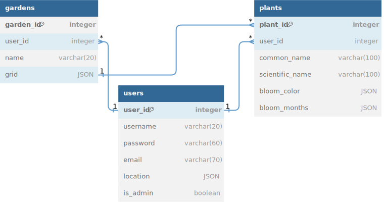

# Gardener Backend

## Overview

This is a Node.js Express backend application that creates a server for maintaining the Gardener app's PostgreSQL database.

## Setup

1. Install [PostgreSQL](https://www.postgresql.org/), start the PostgreSQL server, and create the development and test databases.

2. Install [Node.js and npm](https://docs.npmjs.com/downloading-and-installing-node-js-and-npm).

3. Install packages:

   ```
   $ npm i
   ```

4. Create .env file containing the following variables and add appropriate values:

   ```
   PORT = "[your port #]"
   TEST_DB_URI = "[URI string for your testing database]"
   DEV_DB_URI = "[URI string for your production database]"
   FRONTEND_URL = "[URL string for the frontend of the application]"
   TREFLE_TOKEN = "[token to access trefle API (get at trefle.io)]"
   SECRET_KEY = "[a secret key]"
   BCRYPT_WORK_FACTOR = "[work factor # for bcrypt]"
   ```

   For production, you'll need to set a DB_URI environment variable.

5. Start the development server:
   ```
   $ nodemon server.js
   ```

## Testing

Testing in Jest. To execute, run:

```
$ npm test
```

## External API

This application uses Trefle to gather data on plants for users to save and add to gardens.

https://trefle.io//api/v1

## Database Relationships


